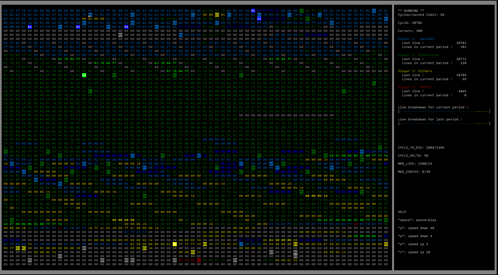

# Corewar_public
Учебный проект на основе компьютерной игры <a href="https://ru.wikipedia.org/wiki/%D0%91%D0%BE%D0%B9_%D0%B2_%D0%BF%D0%B0%D0%BC%D1%8F%D1%82%D0%B8">Corewar</a>. Проект написан на C с самописными стандартными функциями.
 

Компиляция и запуск на UNIX:
Make

./corewar - виртуальная машина, нужно указать до 4х бинарных файла чемпионов в формате *.cor  
-v флаг для визуализации боя 
./asm - перевод кода чемпиона из псевдоассемблера в формате *.s в бинарный код в формате *.cor 
./disasm - обратный перевод байт кода в псевдоассемблер

